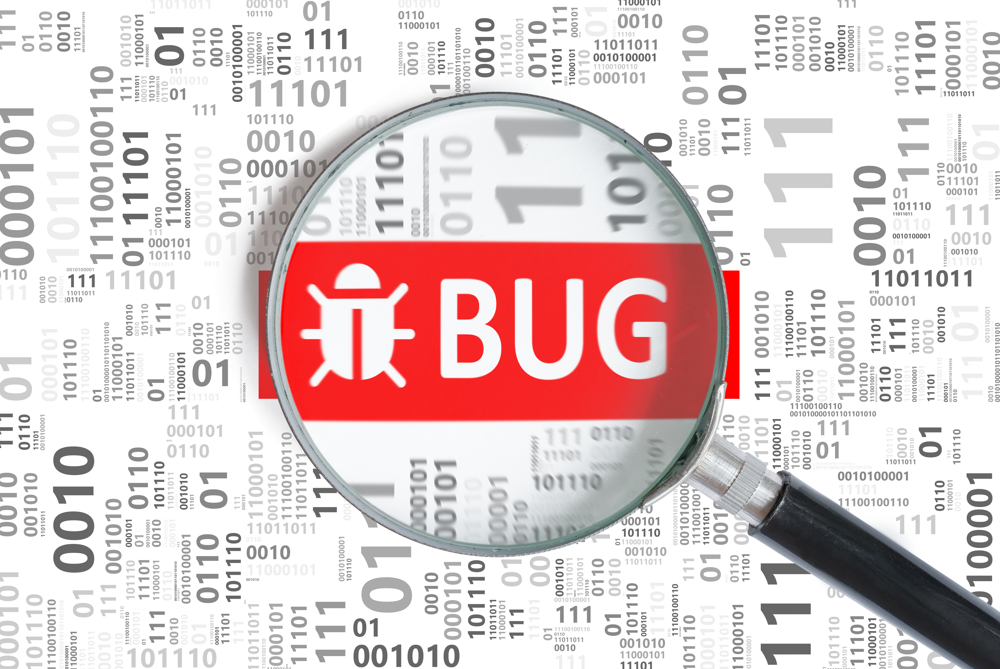

# 203-bug-server


### Goals
Welcome to the Bug Log! 

You have been tasked with creating the server for a tool to better report bugs for your team. The goal, is to have trackable bugs in your application, along with the notes and steps taken to resolve them.

### The Setup
This client side of this app has been completed and setup with a button that will run a set of automated tests to let you know if you have fulfilled all of the requirements of the Bug Log Server. You will be able to access these tests by starting up your server and navigating to `https://localhost:5001/tests`

The client side team has already built a reporting tool for the team and therefore your server must support the needs of the client.

bugs will have a title, description, reportedDate, and in some cases a closedDate.  

Notes about a particular bug can be attached to the bug by the bugId. These notes are intended to be an active record providing detailed steps towards the bugs resolution. Therefore we do not want to support deleting notes or bugs. 

Once a bug has been closed, The bug should be un-editable and should also disable adding additional notes.

### Rules
The boss is a stickler for quality code and is expecting the server to be written following the MVC Standards practiced in Dotnet. Keeping this in mind you will need to have the following files for both the Bugs and their Notes.

**File Conventions:**
- Controller
- Service

Because we are not quite ready to commit to a database all of the bugs will need to be tracked with a `FakeDb Singleton Service`. You will be expected to use the Dependency Injection Container found in `Startup.cs`

All of the business rules for this server need to be validated inside of the appropriate service and failure to pass a validation should throw Exceptions. The client has been setup to handle different status codes and may fail to pass some tests your server reply with `200 Ok` instead of the intended `400 BadRequest`


## Bug Log API

### Interfaces
```csharp
interface IBug 
{
  string Id {get; set;}
  string Title {get; set;}
  string Description {get; set;}
  DateTime ReportedDate {get; set;}
  DateTime LastModified {get; set;}
  DateTime ClosedDate {get; set;}
}

interface IBugNote 
{
  string Id {get; set;}
  string BugId {get; set;}
  string Body {get; set;}
  DateTime Timestamp {get; set;}
}
```

### Required API Endpoints

**HttpGet:**
- `/bugs`: returns list of bugs for the user
- `/bugs/:id`: returns a single bug with all it's data
- `/bugs/:id/notes`: returns all comments for a given bug id

**HttpPost**
- `/bugs`: Creates a new bug
- `/notes`: Adds a new note to the bug. *This can only be done if bug is open*

**HttpPut** 
>*both of these can only be done if bug is open*
- `/bugs/:id`: Edits bug but does not allow the Date Properties to be modified or set by the Client
- `/notes/:id`: Edits note.

**HttpDelete**
> There is no true bug delete, only changing the status of a bug to closed.
- `/bugs/:id`: Changes status of bug from open to close

---------------------------------------------------------------------

## Requirements

### Functionality
- Bugs can be created and marked complete
- Notes can only be created if a valid `bugId` Exists
- Bugs and Notes are not modifiable after the bug is closed
- Dates are set by the Server when the appropriate request is fulfilled
- Proper File and Folder structuring is followed
- RESTful Api Conventions are followed as described above
